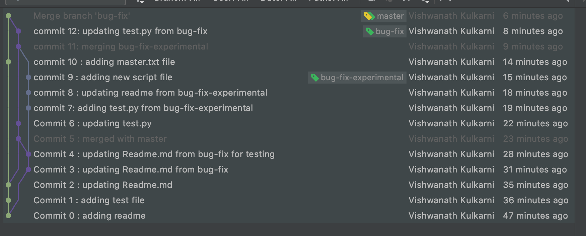

# CSCI 5828 - Spring 2021 

## Homework3

## Team Members:
- Vishwanath Kulkarni (resolved  merge conflict)
- Siddartha Shankar

## Commit Graphs :

## Set of Commands Executed:
    11532  git init
    11533  git status
    11534  vi README.md
    11535  git add .
    11536  git commit -m "Commit 0 : adding readme"
    11537  git status
    11538  git branch bug-fix
    11539  git status
    11540  vi test.py
    11541  git status
    11542  git add .
    11543  git commit -m "Commit 1 : adding test file"
    11544  vi README.md
    11545  git status
    11546  git add .
    11547  git commit -m "Commit 2 : updating Readme.md"
    11548  git status
    11549  git checkout bug-fix
    11550  git status
    11551  vi README.md
    11552  git status
    11553  git add .
    11554  git commit -m "Commit 3 : updating Readme.md from bug-fix"
    11555  git commit -am ""Commit 4 : updating Readme.md from bug-fix""
    11556  git commit -am "Commit 4 : updating Readme.md from bug-fix"
    11557  git log -2
    11558  git status
    11559  git log -1
    11560  git log -2
    11561  vi README.md
    11562  git status
    11563  git add .
    11564  git commit -m "Commit 4 : updating Readme.md from bug-fix for testing"
    11565  git status
    11566  git log -3
    11567  git branch bug-fix-experimental
    11568  git merge master
    11569  git status
    11570  vi README.md
    11571  git status
    11572  git add README.md
    11573  git status
    11574  git commit -m "Commit 5 : merged with master"
    11575  git status
    11576  git log -4
    11577  git status
    11578  vi test.py
    11579  git status
    11580  git add .
    11581  git status
    11582  git commit -m "Commit 6 : updating test.py"
    11583  git status
    11584  git branch -a
    11585  git checkout bug-fix-experimental
    11586  git log -2
    11587  vi test.py
    11588  git status
    11589  git add .
    11590  git commit -m "commit 7: adding test.py from bug-fix-experimental"
    11591  git status
    11592  vi README.md
    11593  git add .
    11594  git commit -m "commit 8 : updating readme from bug-fix-experimental"
    11595  vi bug-fix-experimental.py
    11596  git log -2
    11597  git add .
    11598  git status
    11599  git commit -m "commit 9 : adding new script file"
    11600  git status
    11601  git log -2
    11602  git checkout master
    11603  git status
    11604  vi master.txt
    11605  git add .
    11606  git status
    11607  git commit -m "commit 10 : adding master.txt file"
    11608  git status
    11609  git checkout bug-fix
    11610  git log -2
    11611  ls
    11612  vi test.py
    11613  git status
    11614  git add .
    11615  git status
    11616  git reset --hard
    11617  git status
    11618  git merge bug-fix-experimental
    11619  git status
    11620  vi README.md
    11621  vi test.py
    11622  git status
    11623  git add README.md
    11624  git add test.py
    11625  git commit -m "commit 11: merging bug-fix-experimental"
    11626  vi test.py
    11627  git add .
    11628  git status
    11629  git commit -m "commit 12: updating test.py from bug-fix"
    11630  git status
    11631  git log -2
    11632  git checkout master
    11633  git status
    11634  git log -4
    11635  vi README.md
    11636  lsi
    11637  ls
    11638  vi master.txt
    11639  git add master.txt
    11640  git status
    11641  git reset --hard
    11642  git status
    11643  git merge bug-fix
    11644  git log -3
    11645  git commit --amend
    11646  git log -3
    11647  git status
